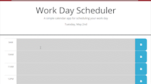

# Work Day Scheduler 

## Description

Remembering work day events is important to meeting deadlines and attending any meetings. Sometimes remembering or keeping tracking of these events is challenging. This project was built because it will help working professionals keep track of work day events. This project was built to ensure any upcoming events are not missed. While building this project I learned about the use of dayjs and local storage.

## Usage

 To use the work day scheduler start by clicking the time block. After clicking inside the timeblock, the text cursor will display with content typed. To save the event on the right hand side of the time block is a blue save button. After clicking the save button, the new event will show and will continue to show even when the page is reloaded. The colors indicate if at the current time the scheduler is loaded the event will happen in the future (green), past (gray) or red (present). 

[Work Day Scheduler Webpage](https://k-pineda.github.io/Work_Day_Scheduler/)

## Credits

[Challenge 5 Repo](https://github.com/k-pineda/Work_Day_Scheduler.git)